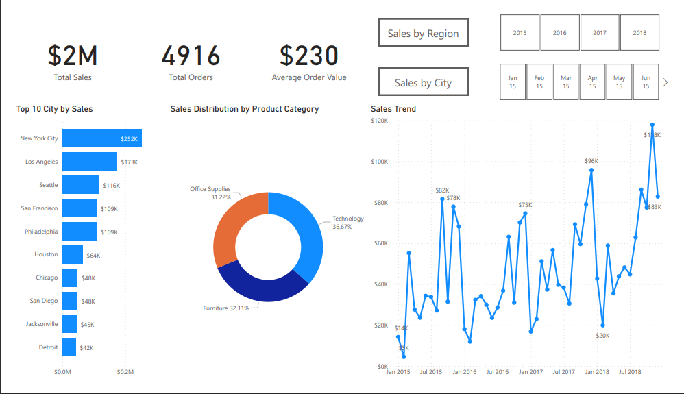
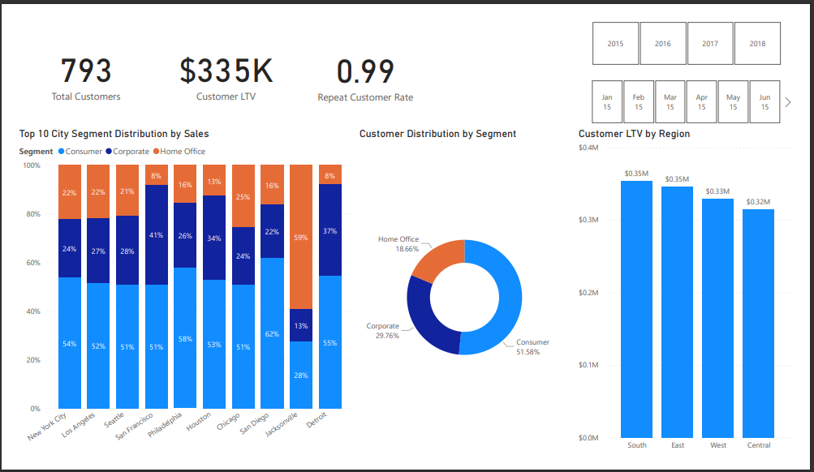
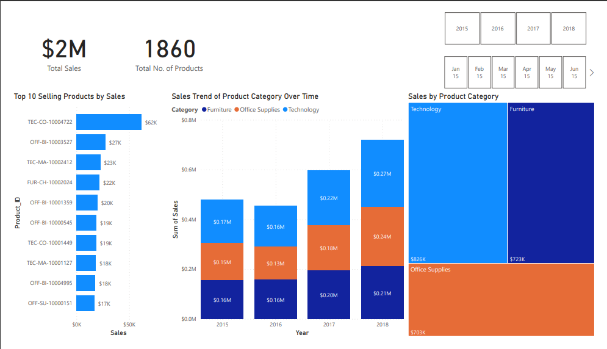

# Sales-Trend-Analysis 🌟
## <b>This project is demonstrating data cleaning and analysis using Python and SQL, along with interactive Power BI Dashboard. 
# Problem Statement 👉
<b>The problem addressed in this project is to analyze the sales data of a superstore and gain valuable insights to drive business decisions. The challenges include cleaning and transforming the raw data, performing exploratory analysis(EDA), and visualizing to findings insights in an intuitive and informative manner.

  
  
  

  

# The repository contains the following components:

  *  Python scripts for data cleaning and transformation of the Excel dataset.
  * SQL dump file for importing the transformed data into a SQL database.
  * SQL queries for performing exploratory analysis and extracting insights from the sales data.
  *  Power BI project file (.pbix) containing the interactive reports with three pages: sales performance, customer analysis, and product analysis.
